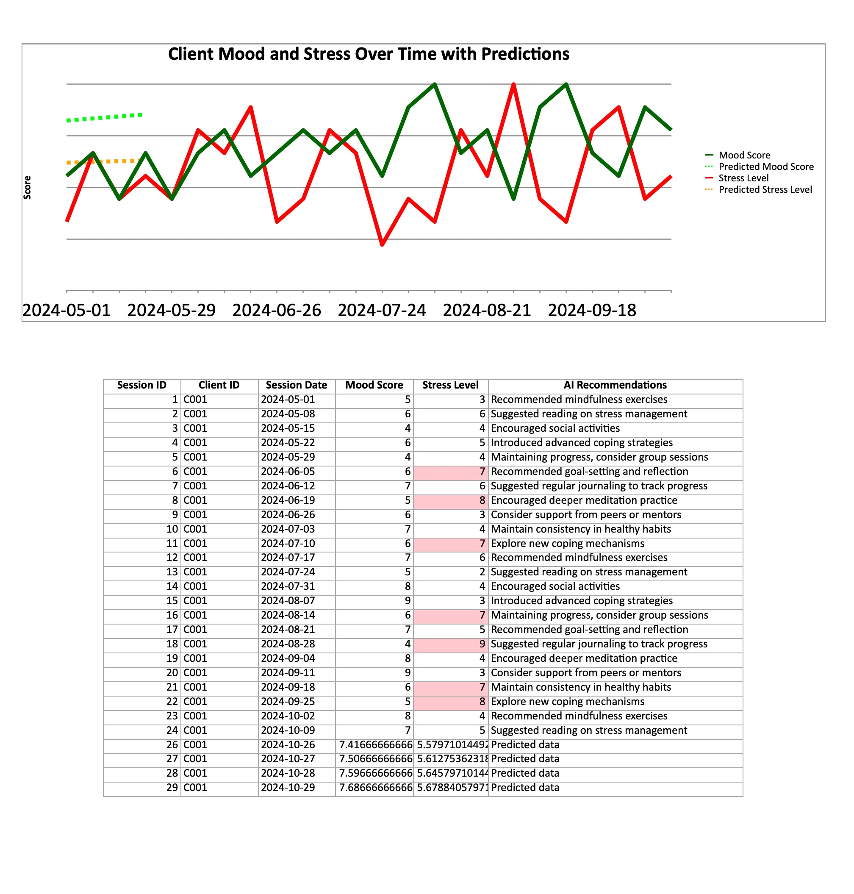

# Client Predictive Insight

**Client Predictive Insight** is a foundational tool designed for tracking, analyzing, and forecasting client mood and stress trends over time. This project provides essential data insights and visualizations, laying the groundwork for future AI-driven enhancements. By focusing initially on data analysis, visualization, and basic predictive modeling, this project establishes a solid base for advanced machine learning and AI integrations.

## Current State: Base Foundation

### Features
1. **Data Analysis**: Tracks client mood and stress over time, providing valuable insights into their progress and well-being.
2. **Visualization**: Creates charts and graphs to visualize historical trends, allowing coaches and clients to easily monitor progress.
3. **Predictive Modeling**: Implements basic linear regression to forecast future mood and stress trends, aiding in proactive client management.

### Technology Stack
- **Python**: Core language for data processing and analysis.
- **openpyxl**: Used to handle Excel file creation, data management, and visualization.
- **scikit-learn**: Provides the predictive modeling foundation through linear regression.
- **numpy**: Supports data manipulation and mathematical operations.

## How to Use
1. **Generate Historical Report**: Use `generate_coaching_report.py` to create a report with historical data, including trend visualizations.
2. **Generate Predictive Report**: Use `predictive_report.py` to create a report with both historical data and 4-week forecasts for mood and stress levels.

### Sample Commands

# Activate the environment
pipenv shell

# Run the historical report
python generate_coaching_report.py

# Run the predictive report
python predictive_report.py

## Project Structure

```
.
├── generate_coaching_report.py       # Main script for generating historical report
├── predictive_report.py              # Script for generating predictive report with trend forecasts
├── data_ops.py                       # Data handling functions
├── chart_ops.py                      # Chart creation functions
├── prediction_ops.py                 # Predictive model functions
└── README.md                         # Documentation
```

## Possible Use Cases and Future Enhancements

**Client Predictive Insight** provides a foundation for tracking and forecasting client well-being trends, and it’s designed with flexibility for future AI-driven enhancements. This project can support a range of possible use cases and can be adapted or extended for unique applications in client management and wellness. 

### Current Use Cases:
- **Predictive Analytics** for client mood and stress trends.
- **Data Visualization** to help coaches and clients easily monitor progress.
- **Basic Insights** to support proactive client management.

# Exploring Future Enhancements:
Looking ahead, this project aims to incorporate advanced AI features to provide deeper insights and more proactive support. Planned enhancements include:

1. **Advanced Predictive Modeling**:
   - Transitioning from linear regression to sophisticated models like decision trees, support vector machines, or neural networks for more nuanced predictions.

2. **Natural Language Processing (NLP)**:
   - Adding NLP to analyze text-based client notes or feedback, with sentiment analysis, keyword extraction, and topic detection to provide richer insights.

3. **Personalized Recommendation Systems**:
   - Developing recommendation engines to offer tailored suggestions, such as coping strategies and resources, based on individual client trends and challenges.

4. **Anomaly Detection**:
   - Implementing AI-driven anomaly detection to identify sudden changes in mood or stress that may require timely intervention.

5. **Time-Series Analysis for Long-Term Forecasting**:
   - Expanding to advanced time-series models for accurate, long-term forecasts that account for seasonal or recurring patterns in mood and stress.

6. **Automated Insight Summaries**:
   - Generating natural language summaries of client progress to help coaches focus on key trends and actionable insights.

These planned enhancements are only the beginning—feel free to use, adapt, or contribute as you explore the potential. Suggestions and collaboration are welcome as we expand the project’s impact in the wellness and coaching domains.


